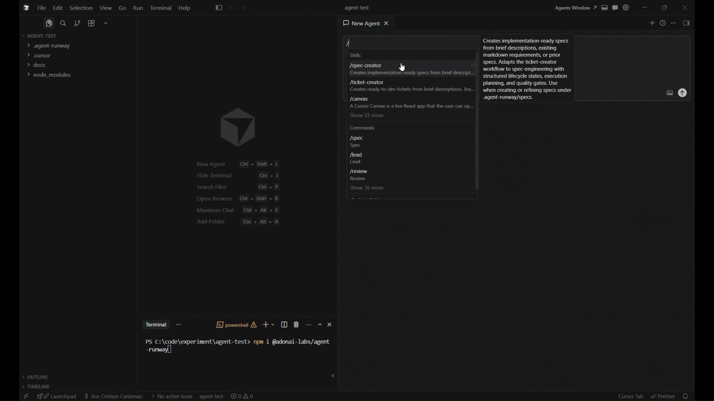
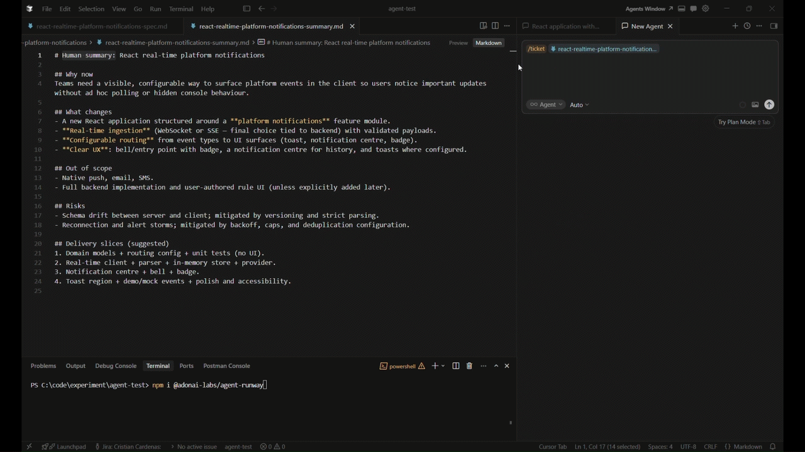
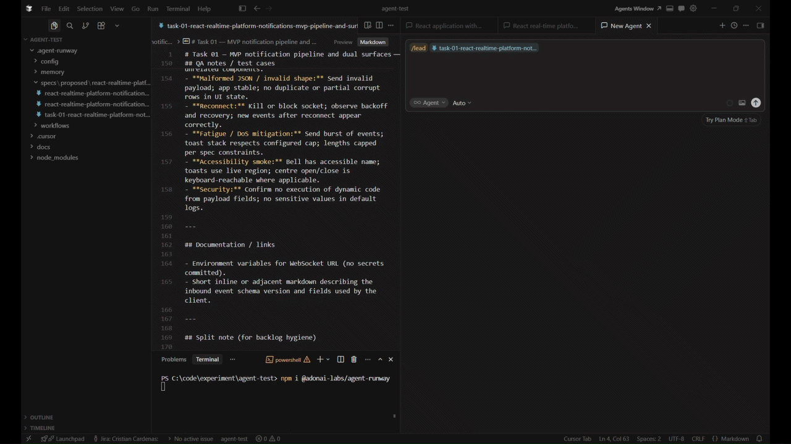

# Agent Runway

[](https://www.npmjs.com/package/@adonai-labs/agent-runway)
[](LICENSE)
[](https://github.com/adonai-labs/agent-runway)
[](https://www.npmjs.com/package/@adonai-labs/agent-runway)

Agent Runway is a structured, AI-assisted development framework installable via npm.

It acts as a **portable planning, execution, and control layer for coding agents**, with install targets for Cursor, Claude Code, and VS Code Copilot.

> 🚀 Agent Runway turns AI coding agents from guessers into disciplined engineers.

> Supported targets: Cursor, Claude Code, and VS Code Copilot.

---

## Why Agent Runway?

AI coding agents are powerful — but without structure they:

* drift from requirements
* repeat the same mistakes
* produce inconsistent code
* lose context between sessions

Agent Runway fixes this by adding:

* structured planning (spec-first or ticket-first)
* controlled execution workflows
* enforced quality gates
* persistent project memory

---

## Core Concept

Agent Runway separates development into four layers:

```
Spec → define intent  
Workflow → orchestrate execution  
Rules → enforce standards  
Memory → learn over time  
```

---

## What Makes Agent Runway Different?

Most AI development tools stop at generating code or defining specs.

Agent Runway goes further:

- drives execution through structured workflows  
- enforces engineering standards via rules  
- prevents repeated mistakes through memory  
- keeps agents aligned with intent from start to finish  

Specs are not passive documentation — they act as **executable guides that actively shape agent behavior**.

---

## Quick Start

Run your first structured AI workflow in seconds:

```bash
npx @adonai-labs/agent-runway@beta init
```

The CLI will ask whether to install in the current project or globally, then which agent environment to configure:

```
? Where should Agent Runway be installed?
  Project - install in this repository
  Global  - install in ~/.cursor for all Cursor projects

? Which AI agent environment are you installing for?
  Cursor
  Claude Code
  VS Code
```

Then it will show you project presets:

```
? What type of project is this?
  🟨 Node.js + TypeScript
  🌐 Full-stack Web (TypeScript + React)
  ⚡ .NET Backend API
  🖥️ Electron Desktop App
  🦀 Rust Systems Programming
  🎯 Core Only (universal rules only)
  🔀 Polyglot Backend
  🔧 Custom Selection
  🚪 Exit
```

Or use presets directly:

```bash
npx @adonai-labs/agent-runway@beta init --preset node-typescript
npx @adonai-labs/agent-runway@beta init --preset web-fullstack-ts
npx @adonai-labs/agent-runway@beta init --stacks node,typescript,react
npx @adonai-labs/agent-runway@beta init --target vscode --preset node-typescript
npx @adonai-labs/agent-runway@beta init --target all --preset web-fullstack-ts
```

Or install it first:

```bash
npm install -D @adonai-labs/agent-runway@beta
npx agent-runway init
```

After initialization:

1. Populate `.agent-runway/docs/` with your domain and architecture context
2. Open the project in your selected agent environment
3. Run `/start` or the equivalent Agent Runway prompt and describe your task

> `/start` classifies intent and routes to the right workflow

---

## Demo

Note: some recordings may still show legacy wrappers (`/spec`, `/ticket`). Preferred usage is `spec-creator` and `ticket-creator`.

### Spec creation (`/spec-creator`)

Create and refine implementation specs before coding.



### Ticket creation (`/ticket-creator`)

Generate implementation-ready tickets from specs or direct chat context.



### Execution with quality gates (`/lead`)

Run phased implementation with checks and review handoff.



---

## Development Entry Points

Agent Runway supports two valid entry points:

### Spec-first (`spec-creator`)

Capture intent, behavior, and design before implementation.

### Ticket-first (`ticket-creator`)

Start from backlog items, chat context, or production issues.

`ticket-creator` now starts with a **Work Item Mode Gate**:
- `epic` — create an epic and propose tickets (`Feature (epic + N tickets)` wording; filenames include the implementation slug)
- `ticket` — create one delivery ticket
- `auto` — let the agent decide from complexity

Both paths converge into a structured execution workflow powered by `lead`, with built-in quality gates and validation.

---

## Delivery Workflow

```
spec-creator
      ↓
ticket-creator
      ↓
architect (optional)
      ↓
lead
      ↓
review
```

### Roles

* **spec-creator** — defines intent and behavior
* **ticket-creator** — prepares execution units (epic or ticket)
* **lead** — executes with quality gates
* **architect** — handles complex design decisions

---

## Engineering Flow, End to End

Example scenario: **add multi-tenant isolation** (`tenant_id`) across API, services, and persistence.

### 1) `/spec` output (excerpt)

```md
# Multi-tenant Data Isolation Spec

## Goal
Ensure each tenant can only access its own resources in all read/write paths.

## Scope
- Add tenant context propagation from auth/session to application layer
- Enforce tenant filters in repositories and query handlers
- Add tenant-aware authorization checks in API endpoints

## Acceptance Criteria
1. Requests without tenant context are rejected with 401/403
2. Cross-tenant reads and writes are blocked
3. Integration tests cover positive and negative isolation cases
```

### 2) `/ticket` output (excerpt)

```md
# task-01-multi-tenant-isolation-enforcement.md

## Objective
Implement tenant isolation for customer-facing resources.

## Scope Includes
- TenantContext provider
- Repository filters by tenant_id
- API policy checks for tenant ownership

## Scope Excludes
- Tenant billing
- Tenant-level branding

## Acceptance Criteria
- All queries include tenant filter
- Unauthorized cross-tenant access returns 403
- Existing non-tenant flows remain unaffected
```

### 3) `/lead` flow (what it enforces)

1. Classifies complexity and boundaries
2. Validates scope and assumptions
3. Runs DRY analysis before coding
4. Plans implementation by layers
5. Applies incremental checks during implementation
6. Runs self-review (SOLID, DRY, security, tests)
7. Delegates independent validation to `/review`
8. Delivers with explicit evidence and outcomes

This is the core value: **from idea to production-ready engineering flow, point to point**.

---

## Learning Loop (Error Memory)

Agent Runway introduces a semi-automatic learning loop.

When the agent detects a repeated error pattern, it will ask whether to register it:

> "I found a repeated error pattern. Do you want me to register it?"

If confirmed, the agent records:

* the failure
* the root cause
* the fix
* prevention guidance

Stored in:

```
.agent-runway/memory/repeated-errors.md
```

This allows each project to become more reliable over time.

---

## Human-Friendly Spec Summary

After creating a spec, `spec-creator` asks:

> "Generate human summary?"

It only generates the summary after explicit user confirmation:

```
.agent-runway/specs/proposed/<implementation-slug>/<implementation-slug>-summary.md
```

The summary is concise and stakeholder-friendly:
- why now
- what changes
- out of scope
- risks
- delivery slices

---

## Installation Options

### Interactive

```bash
npx @adonai-labs/agent-runway@beta init
```

### Preset

```bash
npx @adonai-labs/agent-runway@beta init --preset web-fullstack-ts
```

### Custom stacks

```bash
npx @adonai-labs/agent-runway@beta init --stacks node,typescript,react
```

### Add stacks later

```bash
npx @adonai-labs/agent-runway@beta add dotnet
```

### Update

```bash
npx @adonai-labs/agent-runway@beta update
```

---

## Global vs Project Installation

### Global

```bash
npx @adonai-labs/agent-runway@beta init --scope global --preset core-only
```

Applies to all Cursor projects on your machine. Claude Code and VS Code installs are project-scoped for now.

### Project (default)

```bash
npx @adonai-labs/agent-runway@beta init --scope project --target vscode --preset web-fullstack-ts
```

Recommended for teams and portability.

---

## What Gets Installed

`.agent-runway/` is always created (memory, specs, config, workflows). The rest depends on your chosen targets:

| Target | What gets created |
|--------|-------------------|
| **Cursor** | `.cursor/commands/`, `.cursor/skills/`, `.cursor/rules/`, `.cursor/agents/` |
| **Claude Code** | `.claude/commands/`, `.claude/agents/`, `CLAUDE.md`, `.agent-runway/skills/`, `.agent-runway/rules/` |
| **VS Code** | `.github/copilot-instructions.md`, `.github/instructions/`, `.github/prompts/`, `.github/agents/`, `.github/skills/` |

`.agent-runway/docs/` is also created on first install as a scaffold for project context.

### Core Rules (always included)

* engineering principles
* architecture
* security
* API design
* testing
* performance
* DevOps
* AI safety (OWASP LLM Top 10)

### Stack Modules

Activated based on your stack:

* Node.js
* TypeScript
* .NET / C#
* React
* Rust
* Electron

---

## Commands

### Slash Commands

* `/start` — entry point (routes to the right workflow)
* `/spec` - deprecated wrapper; use `spec-creator` directly
* `/ticket` - deprecated wrapper; use `ticket-creator` directly
* `/lead` — full implementation workflow (quality gates)
* `/fast-lead` — accelerated `/lead` when you already have a plan
* `/express` — minimal-friction path for small, well-scoped changes
* `/dry-check` — reuse analysis (find existing patterns before building)
* `/self-review` — structured self-review checklist before finishing
* `/security-scan` — focused security search pass
* `/review` — structured code review
* `/architect` — design decisions and trade-offs
* `/validate` - deprecated wrapper; use `ticket-eval` directly
* `/po-eval` - deprecated wrapper; use `po-eval` directly

Deprecated wrapper commands (/spec, /ticket, /validate, /po-eval) are scheduled for removal in the next minor release.
* `/refactor` — guided safe refactoring (no behavior change)
* `/dotnet` — .NET/C# guidance (when relevant)
* `/iac` — Infrastructure as Code guidance (Bicep/Terraform)

### CLI

```bash
agent-runway init
agent-runway add <stack>
agent-runway update
agent-runway list
agent-runway status
```

Examples:

```bash
# Add a stack to the current project
agent-runway add dotnet
agent-runway add react

# Add a stack globally (applies to all Cursor projects on this machine)
agent-runway add typescript --global
```

---

## How It Works

```
Developer → Command
        ↓
Workflow (Skill)
        ↓
Rules injected
        ↓
Agents execute
        ↓
Memory + Docs refine behavior
```

---

## Documentation

* Usage Guide
* Contributing Guide
* Extending Guide
* Package Internals

---

## Roadmap

* Dashboard (specs, workflows, quality)
* Advanced spec lifecycle
* Codex / OpenAI Agents support

---

## Final Thought

Agent Runway is not just a framework.

It is a shift:

> from prompt engineering → to structured, disciplined AI development


