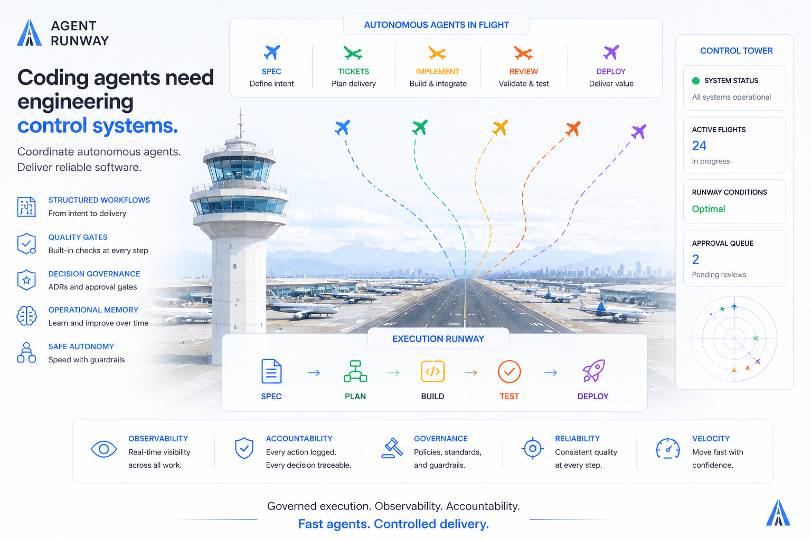

# Agent Runway

[](https://www.npmjs.com/package/@adonai-labs/agent-runway)
[](LICENSE)
[](https://github.com/adonai-labs/agent-runway)
[](https://www.npmjs.com/package/@adonai-labs/agent-runway)

<picture>
  <source media="(prefers-color-scheme: dark)" srcset="assets/overview-dark.png">
  <source media="(prefers-color-scheme: light)" srcset="assets/overview-light.png">
  
</picture>

**Agent Runway is an operational discipline layer for AI-assisted software delivery.**

It gives coding agents a structured execution environment — with workflows, quality gates, decision governance, and persistent engineering memory — so teams can move fast without losing continuity.

It does not replace your stack, your architecture, or your process. It wraps around them.

---

## The problem

Generating code with AI is no longer the hard part. Maintaining continuity across a real codebase is.

Most teams hit the same wall:

- context lost between sessions
- architectural decisions made and forgotten
- the same mistakes showing up in different features
- autonomous execution with no traceability
- implementations that drift from requirements

Agent Runway addresses this by keeping delivery knowledge in the repository — in specs, memory files, run logs, and structured artifacts — not only in chat history that disappears.

> discipline scales better than prompting

---

## What it is not

Agent Runway is not a magic system that removes the need for engineering judgment.

It is not:

- an application framework
- an SDK abstraction layer
- a "fully autonomous AI engineer"
- a replacement for architecture or documentation practices

What it provides instead:

- structured planning (spec-first or ticket-first)
- execution workflows with quality gates
- reusable engineering memory
- governed autonomous operation
- traceable decisions

---

## How it works

Agent Runway is artifact-driven. Work moves through four layers:

```
Spec       →  define intent and behavior
Workflow   →  orchestrate execution with quality gates
Rules      →  enforce standards at every step
Memory     →  capture decisions and lessons for future sessions
```

Artifacts are active engineering context — not passive docs. Specs, tickets, memory files, and run logs shape how agents reason, plan, and execute across sessions.

---

## See it in action

| `/spec-creator` | `/ticket-creator` | `/lead` |
|---|---|---|
|  |  |  |

---

## Quick Start

```bash
npx @adonai-labs/agent-runway init
```

Or install first:

```bash
npm install -D @adonai-labs/agent-runway
npx agent-runway init
```

After initialization:

1. Populate `.agent-runway/docs/` with your domain and architecture context.
2. Open the project in your agent environment (Cursor, Claude Code, or VS Code).
3. Run `/start` and describe what you want to build.

---

## Supported environments

- **Cursor**
- **Claude Code**
- **VS Code Copilot**

The artifact layer is repository-local and portable across all three.

---


## Artifact model

Delivery knowledge lives in the repository, not in chat.

```
.agent-runway/
├── specs/
│   └── <slug>/
│       ├── spec.md
│       ├── epic.md
│       ├── summary.md
│       └── tickets/
│           ├── task-01-<description>.md
│           └── task-02-<description>.md
├── docs/
├── memory/
├── config/
├── workflows/
└── logs/
```

| Artifact  | Purpose |
| --------- | ------- |
| `specs`   | Intent, scope, behavior, and delivery tickets — grouped by feature |
| `memory`  | Repeated mistakes, architectural decisions, lessons learned |
| `docs`    | Business context, architecture, contracts |
| `logs`    | Autonomous execution traces and run decisions |

---

## Work modes

### Lightweight

For small, low-risk, well-scoped work:

- `/express` — minimal ceremony
- `/fast-lead` — accelerated lead when you already have a plan

### Structured delivery

For normal feature work:

- `/spec-creator` — define intent and behavior before implementation
- `/ticket-creator` — create ready-to-dev tickets from descriptions or backlog items
- `/lead` — full implementation workflow with quality gates

### Governed autonomous execution

For unattended runs where you need full traceability:

- `/autonomous-lead` — same quality bar as `/lead`, plus mandatory run logs, ADR gates, and human approval before destructive actions

---

## Before vs after

| Without Agent Runway | With Agent Runway |
|---|---|
| Repeated prompting | Persistent engineering memory |
| Inconsistent implementations | Repeatable execution patterns |
| Lost architectural context | Reusable delivery context |
| Chaotic autonomous runs | Governed autonomous workflows |
| Weak traceability | Traceable decisions and run logs |
| Documentation entropy | Lightweight, useful operational context |

---

## Commands

### Planning

| Command | What it does |
|---|---|
| `/start` | Entry point — routes to the right workflow |
| `/spec-creator` | Create and refine implementation specs |
| `/ticket-creator` | Create ready-to-dev tickets from descriptions or backlogs |
| `/architect` | Design decisions, trade-off analysis, and ADRs |
| `/contrarian` | Adversarial review of a chosen approach — isolated context, clean bias |
| `/po-eval` | Validate specs and tickets from a product perspective |

### Execution

| Command | What it does |
|---|---|
| `/lead` | Full implementation workflow with quality gates |
| `/autonomous-lead` | Autonomous implementation with run logs and ADR gate |
| `/fast-lead` | Accelerated lead for when you already have a plan |
| `/express` | Minimal-friction path for small changes |
| `/refactor` | Guided refactoring without behavior changes |
| `/iac` | Infrastructure as Code guidance (Bicep / Terraform) |
| `/dotnet` | .NET / C# guidance |

### Review and quality

| Command | What it does |
|---|---|
| `/review` | Structured code review |
| `/dry-check` | Reuse analysis before building |
| `/self-review` | Self-review checklist |
| `/security-scan` | Focused security search pass |

### CLI

```bash
agent-runway init          # Initialize project
agent-runway add <stack>   # Add a stack
agent-runway update        # Update framework files
agent-runway list          # List installed stacks
agent-runway status        # Show current installation state
```

---

## Installation details

`init` always creates a local `.agent-runway/` folder with the artifact layer (`specs`, `memory`, `docs`, `config`, `workflows`, `logs`).

Target-specific files:

| Environment | Files installed |
|---|---|
| **Cursor** | `.cursor/commands/`, `.cursor/skills/`, `.cursor/rules/`, `.cursor/agents/` |
| **Claude Code** | `.claude/commands/`, `.claude/agents/`, `CLAUDE.md`, `.agent-runway/skills/`, `.agent-runway/rules/` |
| **VS Code** | `.github/copilot-instructions.md`, `.github/instructions/`, `.github/prompts/`, `.github/agents/`, `.github/skills/` |

### Global installation

```bash
npx @adonai-labs/agent-runway init --scope global --preset core-only
```

Applies commands and rules globally in Cursor. The `.agent-runway/` scaffold is still created per-project so artifacts remain repository-scoped.

### Project installation (default)

```bash
npx @adonai-labs/agent-runway init --scope project --target claude --preset web-fullstack-ts
```

Recommended for teams. All files go into the repository and can be committed and shared.

---

## Who this is for

Agent Runway delivers the most value when:

- your codebase is long-lived
- your team onboards new members often
- architecture consistency matters across features
- you use coding agents heavily and want consistent output
- autonomous execution must stay controlled and traceable

For small or short-lived projects, the lighter paths (`/express`, `/fast-lead`) will cover most of what you need.

---

## Roadmap

- richer workflow orchestration
- advanced spec lifecycle management
- stronger multi-agent coordination
- dashboard and observability
- OpenAI Agents / Codex support
- governance visualization

---

## The bottom line

Most teams don't struggle because AI can't write code.

They struggle because context disappears, decisions are forgotten, and every session starts from scratch.

Agent Runway keeps the knowledge in the repository, where it belongs — so agents and humans can keep building without losing ground.

Start small. Keep what works. Evolve as your team grows.
